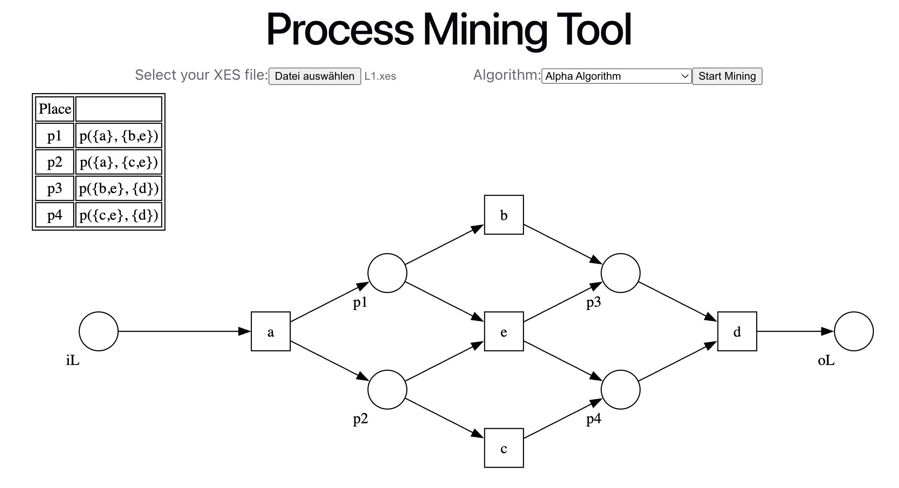

# Process Mining with Alpha Algorithm and Heuristic Miner

## Project Objectives

Implement a web service to provide process discovery results in a lightweight form
to facilitate the analysis of process execution data for non-technical experts.
The web service takes a XES file as input and depicts the results of a process
discovery algorithm.

Algorithms implemented:
- Alpha Algorithm
- Heuristic Miner

## Screenshot



## Tech Stack

- **Backend:** Python 3.12+, Flask (REST API)
- **Frontend:** React 19, Vite 8
- **Algorithms:** Alpha Algorithm, Heuristic Miner
- **Visualization:** Graphviz (SVG output)

## Prerequisites

- Python 3.12+
- Node.js 20+
- Graphviz system package

Install Graphviz (Mac):
```bash
brew install graphviz
```

## Setup

### 1. Clone the project
```bash
git clone https://github.com/phuonganh0804/process-mining-tool.git
cd process-mining-tool
```

### 2. Backend
```bash
python -m venv .venv
source .venv/bin/activate        # Windows: .venv\Scripts\activate
pip install -r requirements.txt
```

### 3. Frontend
```bash
cd frontend
npm install
```

## Running the App

Two terminals are required.

**Terminal 1 — Backend:**
```bash
source .venv/bin/activate
python backend/app.py
```

**Terminal 2 — Frontend:**
```bash
cd frontend
npm run dev
```

Then open http://localhost:5173 in your browser.

## Usage

1. Select a `.xes` file
2. Choose an algorithm (Alpha Algorithm or Heuristic Miner)
3. If using Heuristic Miner, configure the thresholds
4. Click **Start Mining** to view the result

## Datasets

Sample `.xes` files for testing are located in `backend/static/uploads`.

## Known Limitations

- The Alpha Algorithm does not handle loops or duplicate activities well. This is a theoretical limitation of the algorithm itself
- The app runs a single-threaded development server; for production use, a WSGI server like Gunicorn is recommended